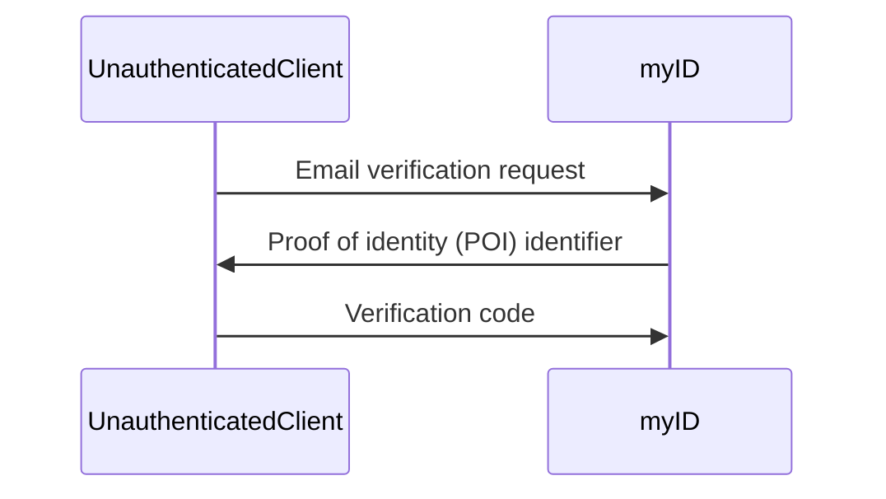
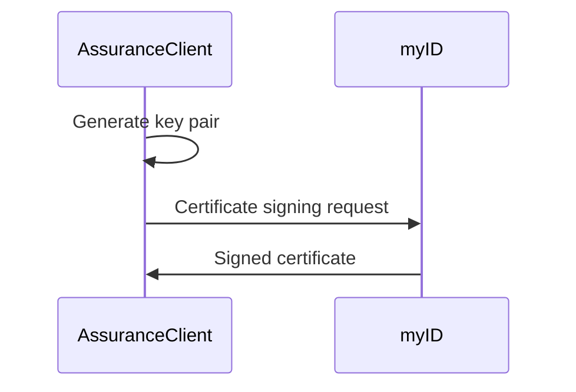
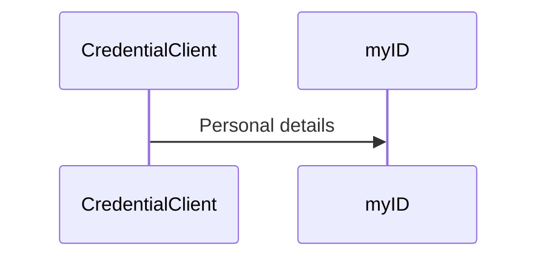
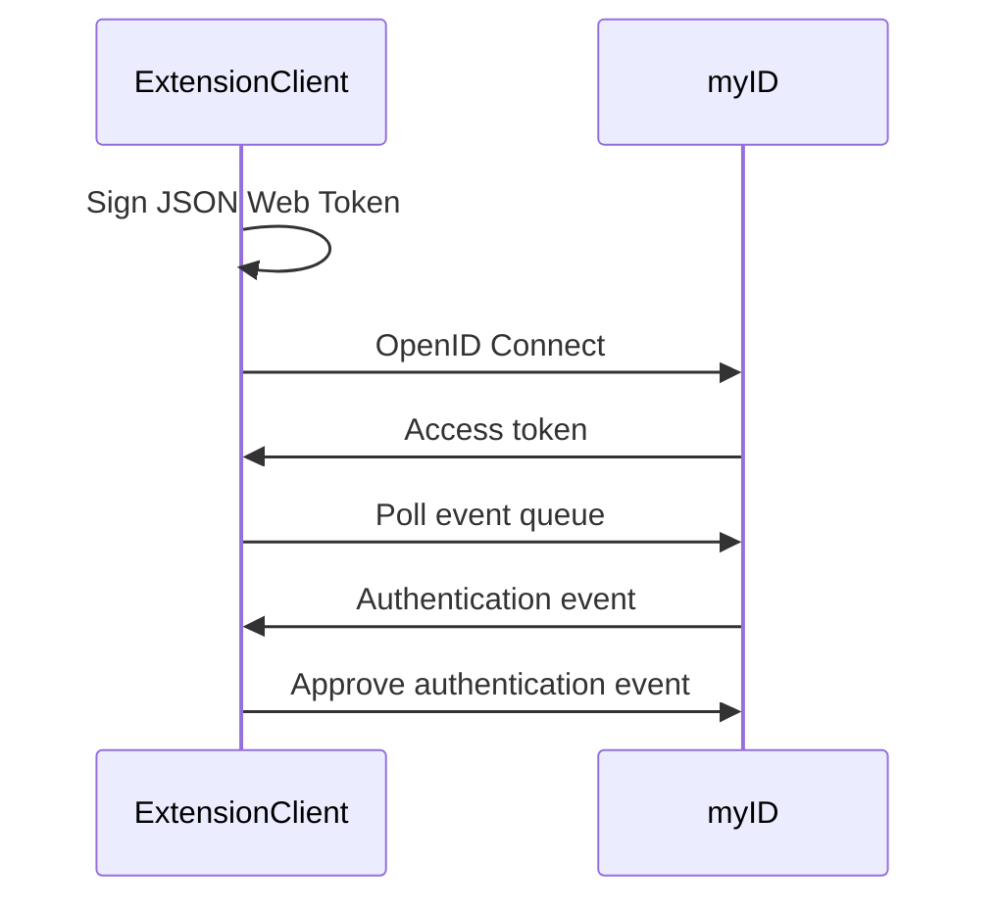

# Open myID 

Use [myID](https://www.myid.gov.au/) without a smartphone.

> [!WARNING]
> This project serves an educational purpose: to understand and document the myID Digital ID system.
> The software is provided "as is" without warranty of any kind, as outlined in the GPL.

## Introduction

myID is the Australian Government's Digital ID app, used to access online government
services.

Reviews on Apple's [App Store](https://apps.apple.com/au/app/myid-australian-government/id1397699449?see-all=reviews)
and [Google Play](https://play.google.com/store/apps/details?id=au.gov.ato.mygovid.droid)
express the Australian public's opinion of the official myID app:

- "Always a pain to use but tonight 45 minutes wasted."
- "Awful, and right before Christmas!"
- "This app is absolute garbage."
- "How is this still so bad?"
- "This app is useless!"
- "Endless circles."
- "Impossible."
- "Terrible."
- "Trash."
- "NO"

This project contains

- `myid.py`: a Python module implementing myID digital identity utilities and clients used to interact with the myID API
- `openmyid.py`: a [Textual](https://textual.textualize.io) application which allows use of myID from a command line or web browser

Open myID runs on any computer, allowing you to authenticate to government services if

- your smartphone is lost or stolen
- you have a wired internet connection only (no Wi-Fi or cellular)
- you have issues with the official app

## Getting started

Open myID works best if you set up your identity on the official app first:

- Install myID
- Create an identity
- Verify your identity to highest security level required

Run Open myID from the command line, directly from this repository, with [uv](https://docs.astral.sh/uv/):

    uvx --from git+https://github.com/eidorb/openmyid openmyid

This command installs all required Python dependencies and runs the Open myID application.

Alternatively, start a web server to use Open myID from a browser (instead of the command line):

    uvx --from git+https://github.com/eidorb/openmyid textual serve openmyid

Open myID stores your encrypted digital identity in an SQLite database (`openmyid.db`) beside the application.
It is **your responsibility** to protect the database and use a strong password.

## Demo

<video src="https://github.com/user-attachments/assets/7696db66-9e9b-4337-8c7e-7e692b2ee706" controls></video>

## How it works

The following diagrams depict simplified high-level interactions with the myID system.

